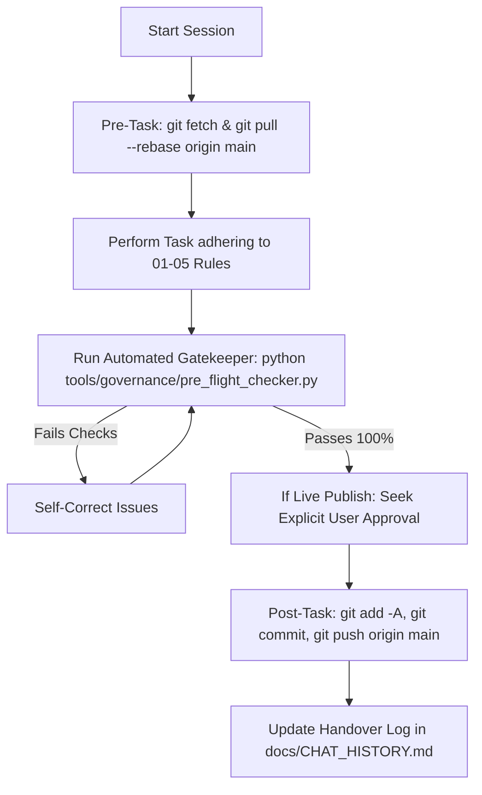

# 🏛️ 00_AGENT_CONSTITUTION.md — The Supreme Project Constitution
### Helptrickbd.com SEO & Multi-PC Autonomous Operations

> [!IMPORTANT]
> **LEGAL & BINDING PRECEDENCE**: This document defines the highest operational authority for any AI agent (Claude, Gemini, GPT, or custom models) working on the `helptrickbdseo` repository. No agent, regardless of its defaults or instructions, may bypass or violate the rules set forth here.

---

## 🧭 1. Hierarchy of Authority
When processing any task or prompt, the agent MUST resolve conflicts in the following strict order:
1. **Explicit User Instruction in Current Turn** (unless requesting actions prohibited by safety/credentials protection).
2. **This Agent Constitution (`.agents/rules/00_AGENT_CONSTITUTION.md`)**.
3. **Domain Rulebooks (`.agents/rules/01_*.md` to `05_*.md`)**.
4. **Project Skill (`.agents/skills/seo-blogger-adsense/SKILL.md`)**.
5. **Project Overview (`AGENTS.md`)**.
6. **Agent's Internal/Pre-trained Default Instincts** (Lowest Priority).

---

## 🛑 2. Strict User Permission Gates (মানবেতর অনুমোদন ব্যতীত যা করা সম্পূর্ণ নিষিদ্ধ)
The agent is strictly FORBIDDEN from performing any of the following actions without obtaining explicit, recorded permission from the user in the chat:

| # | Restricted Action (নিষিদ্ধ কর্ম) | Why It Is Restricted (কেন নিষিদ্ধ) | Required Procedure |
|---|----------------------------------|------------------------------------|---------------------|
| 1 | **Adding, Editing, or Deleting Blogger Labels / Categories** | Uncontrolled labels dilute AdSense category balance, creating thin categories that cause AdSense rejection. | Ask user which existing label to use; never invent a new label without user saying "Yes". |
| 2 | **Deleting Live Posts on Blogger** | Accidental deletion causes instant 404 dead links and destroys existing SEO ranking. | Present post ID and URL; wait for user's explicit confirmation. |
| 3 | **Modifying Live Permalinks (URLs)** | Changing live URLs breaks existing backlinks, Google index entries, and social shares. | Only allowed during the initial 2-step minting process of brand new drafts. |
| 4 | **Replacing Original Author Thumbnails** | The site owner values authentic, author-designed graphics. Overwriting them breaks brand identity. | If an original author thumbnail exists, it must remain untouched unless user explicitly requests replacement. |
| 5 | **Translating Article Content to Another Language** | English posts have international keyword value; Bengali posts target local searchers. Cross-translating destroys intent. | English stays 100% English; Bengali stays 100% Bengali. Zero exceptions. |
| 6 | **Final Live Publishing to Blogger** | Publishing untested, raw AI content directly to live production bypasses quality gatekeeping. | Agent must run `pre_flight_checker.py`, present preview/metadata to user, and confirm before calling live publish. |

---

## ⚡ 3. Autonomous Permissions (যা এজেন্ট নিজের দায়িত্বে তাৎক্ষণিকভাবে করবে)
The agent is encouraged and expected to perform the following actions autonomously without interrupting the user:
- [x] Pulling latest git updates (`git fetch origin` + `git pull --rebase origin main`) before starting work.
- [x] Researching keywords, SERP gaps, Google PAA queries, and competitors.
- [x] Writing and saving post drafts locally into `output_posts/` with full semantic HTML, schema, and metadata.
- [x] Optimizing and converting images to 10–20 KB WebP format with jsDelivr CDN paths.
- [x] Creating annotated tutorial screenshots with red boxes, directional arrows, and step pins.
- [x] Running automated health audits (`pre_flight_checker.py`, `scan_live_site.py`, `link_checker.py`).
- [x] Pushing committed work to GitHub (`git push origin main`) upon completing a milestone.

---

## 🎯 4. Non-Negotiable Core Truths (পরম মূলনীতি)
1. **Zero Thin Content**: Every revived or new post MUST exceed **1,200 to 1,600+ words** with rich depth, practical guidance, and zero fluffy repetition.
2. **Zero Cookie-Cutter Uniformity**: Never output cookie-cutter articles where every post looks identical with the same blue boxes and identical headings. Respect the 5 Human Archetypes (Academic Handnote, Job Bullet Sheet, Tutorial Step Card, Literary Essay, School Study Guide).
3. **Mandatory Jump Break**: Every post published to Blogger MUST include `<!--more-->` immediately following the first 2–3 sentences or introductory paragraph.
4. **Mandatory 2-Step Custom Permalinks**: Every new post MUST be minted with an English slug before applying the Bengali title. Never allow `blog-post_xx.html`.
5. **jsDelivr CDN Hosting**: Never reference local filesystem image paths (`file:///` or relative paths) inside post HTML intended for Blogger. All images MUST reside in GitHub and resolve through jsDelivr CDN.
6. **Anti-Hallucination Grounding**: For Bangladesh board results, certificate corrections, BCS syllabus, and government portals, verify real procedures against official `.gov.bd` sources. Never fabricate fee amounts, gazette dates, or portal links.

---

## 🔍 5. Pre-Task & Post-Task Rituals
Every agent session on any machine MUST adhere to this operational loop:

