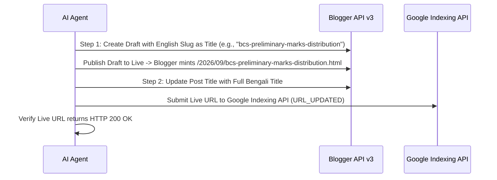

# 🚀 03_PUBLISHING_PERMALINK_RULES.md — Publishing & Custom Permalink Governance
### Helptrickbd.com Blogger API, Custom Slugs & Indexing Protocol

> [!IMPORTANT]
> **CRITICAL SEO PENALTY WARNING**: Blogger automatically generates meaningless generic permalinks like `blog-post_15.html` when a post is initially published with a Bengali title. This permanently harms Google indexing, CTR, and AdSense review. The 2-Step Minting Protocol is **MANDATORY FOR ALL NEW POSTS**.

---

## 🔗 1. The 2-Step Custom Permalink Minting Protocol
Whenever minting a new article on Blogger, follow this sequence without exception:



### Detailed Execution:
1. **Step 01 — English Slug Minting (পারমালিঙ্ক মিন্ট)**:
   - Prepare a clean, hyphenated English keyword slug (e.g., `cloud-computing-types-benefits-guide`).
   - Set the post `title` temporarily to this English slug.
   - Publish the post so Blogger binds the permanent URL `.../YYYY/MM/<slug>.html`.
2. **Step 02 — Bengali Title Replacement (বাংলা টাইটেল প্রতিস্থাপন)**:
   - Immediately patch the post via Blogger API, replacing the temporary slug with the full, rich Bengali headline (e.g., `ক্লাউড কম্পিউটিং কি? প্রকারভেদ, সুবিধা ও বাস্তব ব্যবহার | Cloud Computing Guide`).
   - The permanent URL remains the clean English slug, while the front-facing page displays standard Bengali typography.
3. **Zero Generic Permalinks Policy**:
   - If any script generates a URL containing `blog-post` or `blog-post_`, it is classified as an **Urgent Production Defect**.
   - The post must be purged and re-minted correctly, and the dead URL submitted to Google Indexing API as `URL_DELETED`.

---

## ⚙️ 2. Blogger API v3 Publishing Workflow
1. **Credentials Pre-Check**:
   - Verify `tools/blogger_publisher/client_secrets.json` and `tools/blogger_publisher/blogger_token.json` exist locally.
   - Run `python tools/check_all_credentials.py` if encountering any OAuth error.
2. **Title Extraction Standard**:
   - Publishing scripts must dynamically extract the headline from the `<title>` tag of the HTML document or the corresponding `_metadata.json` file.
   - Never use fallback placeholder titles like `"Updated Post"`.
3. **HTML Sanitization**:
   - Strip all markdown artifacts (```html ... ```) before sending content payload to Blogger API.
   - Ensure all `<style>` blocks contain properly formatted CSS without syntax breaks.

---

## 📡 3. Google Search Console & Indexing API Submission
1. **Instant URL Submission**:
   - Within 60 seconds of updating or publishing any post, call Google Indexing API:
     ```bash
     python tools/indexer/ping_all_revived.py --url <LIVE_URL>
     ```
   - Target notification type: `URL_UPDATED`.
2. **Indexing Log Maintenance**:
   - Record the submitted URL, timestamp, and HTTP response code into `tools/indexer/all_fixed_urls.txt`.
3. **Live Verification**:
   - Run an automated HTTP GET check against the live URL to confirm:
     * HTTP 200 OK status.
     * Correct canonical link header.
     * Zero 404 broken script or stylesheet resources.
