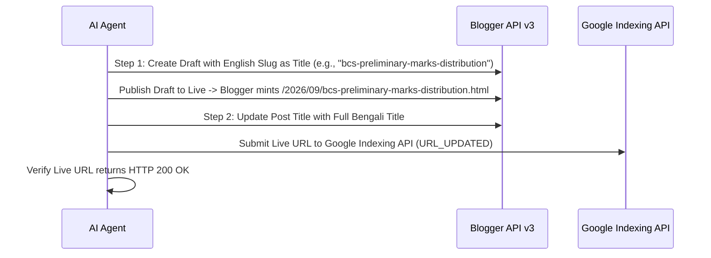

# 🚀 03_PUBLISHING_PERMALINK_RULES.md — Publishing & Custom Permalink Governance
### Helptrickbd.com Blogger API, Custom Slugs & Indexing Protocol

> [!IMPORTANT]
> **CRITICAL SEO PENALTY WARNING**: Blogger automatically generates meaningless generic permalinks like `blog-post_15.html` when a post is initially published with a Bengali title. This permanently harms Google indexing, CTR, and AdSense review. The 2-Step Minting Protocol is **MANDATORY FOR ALL NEW POSTS**.

---

## 🔗 1. The 2-Step Custom Permalink Minting Protocol
Whenever minting a new article on Blogger, follow this sequence without exception:



### Detailed Execution:
1. **Step 01 — English Slug Minting (পারমালিঙ্ক মিন্ট)**:
   - Prepare a clean, hyphenated English keyword slug (e.g., `cloud-computing-types-benefits-guide`).
   - Set the post `title` temporarily to this English slug.
   - Publish the post so Blogger binds the permanent URL `.../YYYY/MM/<slug>.html`.
2. **Step 02 — Bengali Title Replacement (বাংলা টাইটেল প্রতিস্থাপন)**:
   - Immediately patch the post via Blogger API, replacing the temporary slug with the full, rich Bengali headline (e.g., `ক্লাউড কম্পিউটিং কি? প্রকারভেদ, সুবিধা ও বাস্তব ব্যবহার | Cloud Computing Guide`).
   - The permanent URL remains the clean English slug, while the front-facing page displays standard Bengali typography.
3. **Zero Generic Permalinks Policy**:
   - If any script generates a URL containing `blog-post` or `blog-post_`, it is classified as an **Urgent Production Defect**.
   - The post must be purged and re-minted correctly, and the dead URL submitted to Google Indexing API as `URL_DELETED`.

---

## ⚙️ 2. Blogger API v3 Publishing Workflow
1. **Credentials Pre-Check**:
   - Verify `tools/blogger_publisher/client_secrets.json` and `tools/blogger_publisher/blogger_token.json` exist locally.
   - Run `python tools/check_all_credentials.py` if encountering any OAuth error.
2. **Title Extraction Standard**:
   - Publishing scripts must dynamically extract the headline from the `<title>` tag of the HTML document or the corresponding `_metadata.json` file.
   - Never use fallback placeholder titles like `"Updated Post"`.
3. **HTML Sanitization**:
   - Strip all markdown artifacts (```html ... ```) before sending content payload to Blogger API.
   - Ensure all `<style>` blocks contain properly formatted CSS without syntax breaks.

---

## 📡 3. Google Search Console, Indexing API & Real-Time WebSub Hub Submission
1. **Instant URL Submission (Google Indexing API)**:
   - Within 60 seconds of updating or publishing any post, call Google Indexing API:
     ```bash
     python tools/indexer/index_now.py --url <LIVE_URL>
     ```
   - Target notification type: `URL_UPDATED`.
2. **Mandatory Real-Time Google WebSub (PubSubHubbub) Hub Pinger (রিয়েল-টাইম ফিড পুশ)**:
   > [!IMPORTANT]
   > **গুগল রিয়েল-টাইম ফিড রিডার কল**: যেকোনো নতুন পোস্ট পাবলিশ কিংবা পুরাতন পোস্ট আপডেট করার পর বাধ্যতামূলকভাবে নিচের কমান্ডটি একবার চালাতে হবে। এটি গুগলের অফিসিয়াল সেন্ট্রাল হাবে (`pubsubhubbub.appspot.com`) এবং Superfeedr হাবে তাৎক্ষণিক `HTTP 204` পুশ সিগন্যাল পাঠিয়ে গুগলবটের রিয়েল-টাইম ফিড রিডারকে সেকেন্ডের মধ্যে সাইটে ডেকে আনে:
   ```bash
   python tools/indexer/pubsub_hub_pinger.py
   ```
3. **Indexing Log Maintenance**:
   - Record the submitted URL, timestamp, and HTTP response code into `tools/indexer/all_fixed_urls.txt`.
4. **Live Verification**:
   - Run an automated HTTP GET check against the live URL to confirm:
     * HTTP 200 OK status.
     * Correct canonical link header.
     * Zero 404 broken script or stylesheet resources.

---

## 📝 4. Mandatory Search Description Delivery Protocol (১৫০ অক্ষরের মধ্যে কপি-রেডি সার্চ ডেসক্রিপশন প্রটোকল)
> [!IMPORTANT]
> **Blogger API v3 Limitation & Solution**:
> গুগলের ব্লগার এপিআই v3 দিয়ে পোস্টের 'Search Description' ফিল্ডটি প্রোগ্রাম্যাটিক্যালি আপডেট করার কোনো অফিসিয়াল ব্যাকএন্ড সাপোর্ট নেই।
> অতএব, প্রতিটি পোস্ট (নতুন পাবলিশ কিংবা পুরাতন এডিট) সম্পন্ন হওয়ামাত্র যেকোনো এজেন্টকে ইউজারকে বাধ্যতামূলকভাবে প্রদান করতে হবে:
> 1. **Post Title (পোস্টের সঠিক পূর্ণাঙ্গ শিরোনাম)**
> 2. **Ready-to-Paste Search Description (১৩০–১৪৮ অক্ষরের মধ্যে পারফেক্ট এসইও র‍্যাঙ্কিং সার্চ ডেসক্রিপশন)**
>    - ক্যারেক্টার লিমিট: **বাধ্যতামূলকভাবে ১০০% ১৫০ অক্ষরের ভেতরে হতে হবে** (ব্লগারের Search Description বক্সের লিমিট সর্বোচ্চ ১৫০ অক্ষর)।
>    - বিষয়বস্তু: মূল কি-ওয়ার্ড, টার্গেট পাঠক (যেমন: জাতীয় বিশ্ববিদ্যালয়/বিসিএস/মাস্টার্স/চাকরি প্রস্তুতি) এবং মডেল উত্তর/গাইড সম্পর্কিত স্পষ্ট আকর্ষণীয় লাইন।
>    - উপস্থাপন: ইউজারের এক ক্লিকে কপি করার সুবিধার্থে চ্যাটে এবং `walkthrough.md`-তে আলাদা কপি-রেডি কোড ব্লকে বা কোট বক্সে উপস্থাপন করতে হবে।

---

## 🛡️ 5. Automated Pre-Publish Validation Gate (প্রি-পাবলিশ ভ্যালিডেশন চেকলিস্ট)
> [!IMPORTANT]
> **Zero-Defect Publishing Rule**: পোস্ট পাবলিশের পূর্বে যেকোনো এজেন্টকে স্বয়ংক্রিয়ভাবে নিচের চেকলিস্টটি ভ্যালিডেট করতে হবে। কোনো শর্ত অপূর্ণ থাকলে পোস্ট ড্রাফট বা লাইভ পাবলিশ করা যাবে না:

| ক্রম | যাচাইয়ের বিষয় (Quality Gate Item) | বাধ্যতামূলক মানদণ্ড |
|:---:|:---|:---|
| ১ | **Hero Image LCP** | প্রথম ছবিতে `loading="eager" fetchpriority="high" decoding="async"` এবং `width="1200" height="675"` থাকতে হবে। ভুলেও `loading="lazy"` থাকা যাবে না। |
| ২ | **In-Body Lazy Images** | বডির সব ছবিতে `loading="lazy" decoding="async"`, WebP ফরম্যাট ও অর্থপূর্ণ বাংলা `alt` ট্যাগ থাকতে হবে। |
| ৩ | **Zero Markdown Leaks** | এইচটিএমএল ট্যাগের ভেতরে কোনো `[` বা `]` বা ভুল মার্কডাউন ব্র্যাকেট থাকা যাবে না (যেমন `<a href="[url](url)">` সম্পূর্ণ নিষিদ্ধ)। |
| ৪ | **Canonical Internal Links** | অভ্যন্তরীণ কোনো লিঙ্কে `?m=1` থাকা যাবে না; সব লিঙ্ক মূল ডেস্কটপ ক্যানোনিকাল ইউআরএল হতে হবে। |
| ৫ | **Content Depth & Answer Box** | মোট শব্দ সংখ্যা ১,২০০+ হতে হবে; প্রথম ১০০ শব্দের মধ্যে ডাইরেক্ট অ্যান্সার বক্স (`.htbd-overview-box`) এবং কমপক্ষে ১টি রেসপনসিভ টেবিল থাকতে হবে। |
| ৬ | **Label Limit** | সর্বোচ্চ ১ থেকে ২টি অনুমোদিত ক্যাটাগরি লেবেল নির্বাচন করতে হবে। |
| ৭ | **2-Step Custom Permalink** | ৩–৫ শব্দের ক্লিন ইংরেজি হাইফেনযুক্ত স্লাগ দিয়ে পারমালিঙ্ক মিন্ট করতে হবে। |
| ৮ | **Search Description** | ১৩০–১৫০ অক্ষরের মধ্যে আকর্ষণীয় বাংলা সার্চ ডেসক্রিপশন প্রস্তুত রাখতে হবে। |
