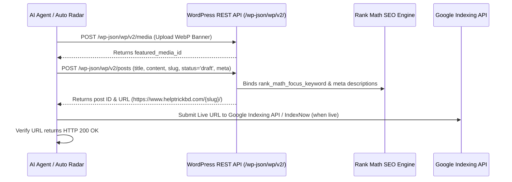

# 03_PUBLISHING_PERMALINK_RULES.md — Publishing & Custom Permalink Governance
### Helptrickbd.com WordPress REST API, Clean Slugs & Indexing Protocol

> [!IMPORTANT]
> **CLEAN PERMALINK STANDARD**: On WordPress (https://www.helptrickbd.com), permalinks are permanently configured to Post Name (`/%postname%/`). Every published post must have a clean, lowercase, hyphenated English keyword slug (e.g., `nu-honours-2nd-year-exam-routine`). Zero dates, zero `.html` extensions, and zero random numeric suffixes.

---

## 1. WordPress Native Clean Permalink Standards
Whenever minting a new article on WordPress, follow this protocol:


```mermaid
sequenceDiagram
    participant Agent as AI Agent / Auto Radar
    participant WP as WordPress REST API (/wp-json/wp/v2/)
    participant RankMath as Rank Math SEO Engine
    participant Google as Google Indexing API
    
    Agent->>WP: POST /wp-json/wp/v2/media (Upload WebP Banner)
    WP-->>Agent: Returns featured_media_id
    Agent->>WP: POST /wp-json/wp/v2/posts (title, content, slug, status='draft', meta)
    WP->>RankMath: Binds rank_math_focus_keyword & meta descriptions
    WP-->>Agent: Returns post ID & URL (https://www.helptrickbd.com/{slug}/)
    Agent->>Google: Submit Live URL to Google Indexing API / IndexNow (when live)
    Agent->>Agent: Verify URL returns HTTP 200 OK
```

### Detailed Execution:
1. **Clean Slug Selection (ক্লিন স্লাগ নির্ধারণ)**:
   - Always formulate a concise, keyword-rich English slug matching user search intent (e.g., `ssc-bangla-1st-paper-creative-questions`).
   - Format: Lowercase, alphanumeric, hyphen-separated. Zero spaces, zero Bengali characters, zero `.html`.
2. **Direct Bengali Title & Excerpt Assignment**:
   - The post `title` in WordPress holds the full, rich Bengali headline (e.g., `এসএসসি ২০২৭ বাংলা ১ম পত্র সৃজনশীল প্রশ্নব্যাংক ও সাজেশন্স`).
   - The `slug` field (`post_name`) is directly bound to the clean English slug in the same API request.
   - No 2-step hacking needed: WordPress natively keeps the clean permalink while displaying rich Bengali typography everywhere.
3. **Draft vs Live Default**:
   - By default, automated scripts create posts with `status: "draft"` to enable editorial review.
   - When verified or instructed by user, posts transition to `status: "publish"`.

---

## 2. WordPress REST API Publishing Workflow (`tools/wp_publisher/`)
1. **Credentials Management**:
   - Authentication is handled via WordPress Application Passwords stored in `tools/wp_publisher/config.json`.
   - Never expose application passwords in public commits.
2. **Featured Media Binding**:
   - Upload official 16:9 WebP banner to `/wp-json/wp/v2/media`.
   - Set the returned attachment ID as `featured_media`.
3. **Rank Math SEO Postmeta Integration**:
   - Always bind:
     * `rank_math_title`: Rich SEO Title Tag.
     * `rank_math_description`: 150-160 character compelling meta description.
     * `rank_math_focus_keyword`: Primary target search query.
     * `rank_math_robots`: `["index"]`.

---

## 3. Real-Time Indexing and Hub Notification
1. **Google Indexing API & IndexNow**:
   - When published live, immediately submit the URL:
     ```bash
     python tools/indexer/index_now.py --url https://www.helptrickbd.com/<slug>/
     ```
2. **WebSub (PubSubHubbub) Real-Time Notification**:
   - Instant feed pinging to Google PubSubHubbub hub (`https://pubsubhubbub.appspot.com/publish`) via `tools/indexer/pubsub_hub_pinger.py`.
