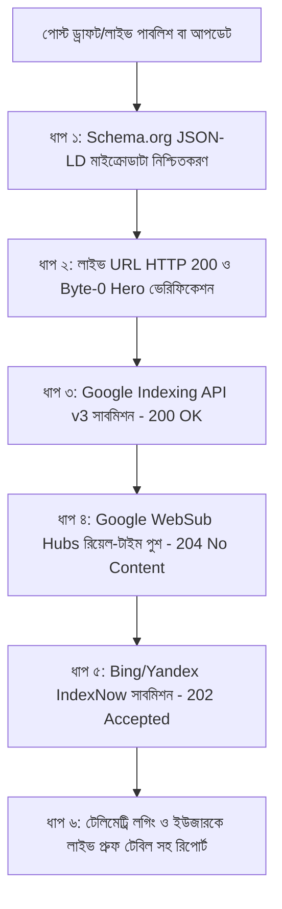

# 🌐 11_POST_PUBLISH_INDEXING_AND_VERIFICATION_PROTOCOL.md
### Helptrickbd.com Post-Completion Indexing, Multi-Engine Push & Proof Verification Governance

> [!IMPORTANT]
> **ABSOLUTE RULE — ZERO PREMATURE REPORTING (অসম্পূর্ণ কাজের রিপোর্ট সম্পূর্ণ নিষিদ্ধ)**:
> ব্লগারে কোনো নতুন পোস্ট পাবলিশ কিংবা পুরাতন পোস্ট আপডেট করার পর, নিচের ৬টি টেকনিক্যাল ধাপ **শতভাগ সম্পন্ন ও লাইভ সার্ভার থেকে কনফার্ম না হওয়া পর্যন্ত** কোনো এজেন্ট ইউজারকে "কাজ শেষ" বা "পোস্ট কমপ্লিট" জানাতে পারবে না।
> প্রতিটি পোস্ট সম্পন্নের পর লাইভ স্ট্যাটাস কোড (HTTP 200, 204, 202) সহ সুনির্দিষ্ট প্রমাণ উপস্থাপন করে তবেই ইউজারকে রিপোর্ট করতে হবে।

---

## 🏛️ ১. পোস্ট সম্পন্নের পর বাধ্যতামূলক ৬-ধাপ পাইপলাইন (The Mandatory 6-Step Post-Publish Pipeline)



---

## 📋 ২. প্রতিটি ধাপের বিস্তারিত স্ট্যান্ডার্ড

### ধাপ ০১: Schema.org রিচ স্নsnippet মাইক্রোডাটা (JSON-LD)
প্রতিটি পোস্টের এইচটিএমএলে অবশ্যই নিচের তিনটি স্কিমা অন্তর্ভুক্ত থাকতে হবে:
1. **`BlogPosting`**:
   - `headline`: পোস্টের পূর্ণাঙ্গ আকর্ষণীয় শিরোনাম।
   - `image`: সিডিএন-হোস্টেড 16:9 1200x675 WebP ছবির ইউআরএল।
   - `datePublished` ও `dateModified`: বর্তমান ISO-8601 টাইমস্ট্যাম্প।
   - `author`: `Person` -> `Faruk Sir`।
   - `publisher`: `Organization` -> `HelpTrickBD`।
   - `description`: মূল বিষয়ের সারসংক্ষেপ।
2. **`FAQPage`**:
   - কমপক্ষে ২–৩টি মূল কনসেপচুয়াল বা বোর্ড পরীক্ষার প্রশ্ন ও উত্তর, যাতে গুগল সার্চ রেজাল্টে সরাসরি রিচ স্নsnippet একর্ডিয়ন ড্রপডাউন শো করে।
3. **`BreadcrumbList`**:
   - হোমপেজ -> ক্যাটাগরি লেবেল -> বর্তমান পোস্টের নেভিগেশনাল পাথ।

---

### ধাপ ০২: লাইভ সার্ভার টেস্ট (HTTP 200 & Byte-0 Hero Verification)
পোস্টটি ব্লগারে লাইভ হওয়ামাত্র স্বয়ংক্রিয় GET রিকোয়েস্ট চালিয়ে যাচাই করতে হবে:
- **HTTP Status:** বাধ্যতামূলকভাবে `200 OK` হতে হবে।
- **Canonical Match:** ব্লগে থাকা `<link rel="canonical">` পোস্টের মূল ডেস্কটপ ইউআরএল-এর সাথে শতভাগ মিলতে হবে।
- **Byte-0 Placement:** মূল হিরো ইমেজ পোস্টের শুরুতেই (< ১০০ ক্যারেক্টার) থাকতে হবে এবং ভূমিকা শেষে `<!--more-->` ট্যাগ অক্ষুণ্ণ থাকতে হবে।

---

### ধাপ ০৩: গুগল ইনডেক্সিং এপিআই সাবমিশন (Google Indexing API v3)
- সার্ভিস অ্যাকাউন্ট দিয়ে সরাসরি গুগলের ইনডেক্সিং গেটওয়েতে রিকোয়েস্ট পাঠাতে হবে:
  ```bash
  python tools/indexer/index_now.py --url <LIVE_URL>
  ```
- **সাকসেস ক্রাইটেরিয়া:** `Status: 200 OK` সহ `indexing_history.log`-এ এন্ট্রি রেকর্ড হতে হবে।

---

### ধাপ ০৪: রিয়েল-টাইম গুগল ফিড পুশ (WebSub / PubSubHubbub)
- গুগলের সেন্ট্রাল ফিড হাব ও সুপারফিডারে সাইটের ফিড ও সাইটম্যাপ পুশ করতে হবে:
  ```bash
  python tools/indexer/pubsub_hub_pinger.py
  ```
- **সাকসেস ক্রাইটেরিয়া:** `pubsubhubbub.appspot.com` এবং `pubsubhubbub.superfeedr.com` থেকে `HTTP 204 No Content` রেসপন্স নিশ্চিত করতে হবে।

---

### ধাপ ০৫: বিং ও ইয়ানডেক্স ইনডেক্সনাও সাবমিশন (IndexNow API)
- মাইক্রোসফট বিং, ইয়াহু এবং ইয়ানডেক্সে তাৎক্ষণিক ক্রল নিশ্চিত করতে IndexNow এন্ডপয়েন্টে ইউআরএল পুশ করতে হবে:
  - এন্ডপয়েন্ট: `https://api.indexnow.org/indexnow`, `https://www.bing.com/indexnow`, `https://yandex.com/indexnow`
- **সাকসেস ক্রাইটেরিয়া:** `Status 202 Accepted`।

---

### ধাপ ০৬: প্রমাণ যাচাই ও চূড়ান্ত ইউজার রিপোর্টিং (The Proof Verification Gate)
উপরের ৫টি ধাপ শতভাগ সম্পন্ন হওয়ার পর এজেন্ট ইউজারকে চ্যাটে এবং `walkthrough.md`-তে রিপোর্ট প্রদান করবে। রিপোর্টে বাধ্যতামূলকভাবে নিচের উপাদানগুলো থাকবে:

1. **লাইভ ইনডেক্সিং ভেরিফিকেশন টেবিল (Proof Matrix):**
   | প্যারামিটার | টেস্টের ফলাফল | স্ট্যাটাস |
   |:---|:---:|:---:|
   | **Live HTTP Status** | `200 OK` | Verified |
   | **Canonical URL Match** | `MATCH` | Verified |
   | **Schema.org Microdata** | `BlogPosting`, `FAQPage`, `BreadcrumbList` | Active |
   | **Google Indexing API** | `200 OK (Notified)` | Queued |
   | **Google WebSub Hubs** | `HTTP 204 No Content` | Ingested |
   | **IndexNow (Bing/Yandex)** | `202 Accepted` | Pushed |

2. **কপি-রেডি সার্চ ডেসক্রিপশন (Search Description Box):**
   - ব্লগারের জন্য ১০০% ১৫০ অক্ষরের ভেতরে তৈরি করা আকর্ষণীয় মেটা ডেসক্রিপশন, যা ইউজার এক ক্লিকে কপি করে ব্লগারের সেটিংসে পেস্ট করতে পারবেন।

---

## 🛠️ ৩. ইউনিফাইড পোস্ট-পাবলিশ ভেরিফায়ার কমান্ড (One-Command Tool)
এজেন্টদের এই ৬টি ধাপ দ্রুত ও ত্রুটিহীনভাবে সম্পন্ন করার জন্য নির্ধারিত মাস্টার টুল:
```bash
python tools/indexer/post_publish_verifier.py --url <LIVE_URL> --html <HTML_PATH>
```
এই স্ক্রিপ্টটি স্বয়ংক্রিয়ভাবে স্কিমা চেক, লাইভ ফেচ, গুগল এপিআই, ওয়েবসাব, এবং ইনডেক্সনাও কল করে একটি স্বয়ংসম্পূর্ণ ভেরিফিকেশন টেবিল তৈরি করে দেবে।

---

## ⚖️ ৪. এনফোর্সমেন্ট ও অডিট রুল
- কোনো এজেন্ট যদি এই প্রটোকলের কোনো একটি ধাপ এড়িয়ে ইউজারকে কাজ সম্পন্ন বলে ঘোষণা করে, তবে তা **গুরুতর প্রজেক্ট নীতিমালা লঙ্ঘন (Critical Governance Violation)** হিসেবে গণ্য হবে।
- প্রতিটি কাজের সেশন শেষে গিট কমিট ও পুশের পূর্বে `tools/governance/check_all_governance.py` স্বয়ংক্রিয়ভাবে এই রুলবুকের সক্রিয়তা যাচাই করবে।
