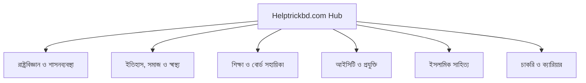

# 🏛️ Helptrickbd Topical Authority & Silo Cluster Blueprint
**Generated Date:** 2026-09-15 07:59 UTC
**Total Live Articles Analyzed:** 78 | **Total Silo Clusters:** 7

> গুগলের Helpful Content System ও Topical Authority অ্যালগরিদমে শীর্ষ র‍্যাংক পাওয়ার জন্য নিচে প্রতিটি কন্টেন্ট সাইলোর আর্কিটেকচার তুলে ধরা হলো।

## 📊 ১. সাইলো ক্লাস্টার সামারি ও হেলথ স্কোর
| ক্রম | কনটেন্ট সাইলো (Topic Silo) | বর্তমান পোস্ট | পিলারের স্থিতি | সাইলো হেলথ | স্ট্যাটাস |
| :---: | :--- | :---: | :--- | :---: | :---: |
| 1 | **সাধারণ জ্ঞান ও অন্যান্য (General Studies)** | **36 টি** | [`১৯০৯ সালের ভারত শাসন আইন:...`](https://www.helptrickbd.com/2025/12/morley-minto-reforms-1909-features-importance.html) | `100%` | 🟢 Strong |
| 2 | **শিক্ষা ও বোর্ড শিক্ষার্থী সহায়িকা (Academic & Board Guides)** | **5 টি** | [`আল্লাহুম্মা সাল্লি আলা সা...`](https://www.helptrickbd.com/2025/03/allahumma-salli-ala-sayyidina-muhammad-lyrics.html) | `83%` | 🟡 Good |
| 3 | **রাষ্ট্রবিজ্ঞান ও শাসনব্যবস্থা (Political Science)** | **14 টি** | [`সার্বভৌমত্ব কি? সংজ্ঞা, ব...`](https://www.helptrickbd.com/2026/01/sarbobhoumotto-ki-songga-boishisto-o-prokarved.html) | `100%` | 🟢 Strong |
| 4 | **আইসিটি ও কম্পিউটার শিক্ষা (ICT & Technology)** | **2 টি** | [`কম্পিউটারের প্রজন্ম: ১ম থ...`](https://www.helptrickbd.com/2025/12/computer-generations-features-part3.html) | `33%` | 🔴 Needs Posts |
| 5 | **ইতিহাস, সমাজ ও স্বাস্থ্য (History & Society)** | **13 টি** | [`বাংলাদেশে শিল্প জাতীয়করণ...`](https://www.helptrickbd.com/2026/01/bangladeshe-shilpo-jatiyokoron-shomossha.html) | `100%` | 🟢 Strong |
| 6 | **ইসলামিক সাহিত্য ও নাশিদ (Islamic Literature)** | **6 টি** | [`আল্লাহ আল্লাহ আল্লাহু লা ...`](https://www.helptrickbd.com/2025/03/allah-allah-allahu-la-ilaha-illa-hu-lyrics.html) | `100%` | 🟢 Strong |
| 7 | **চাকরি ও ক্যারিয়ার প্রস্তুতি (Job & Career)** | **2 টি** | [`অলস ও ব্যাকবেঞ্চারদের জন্...`](https://www.helptrickbd.com/2024/12/simple-guide-to-job-and-bcs-preparation.html) | `33%` | 🔴 Needs Posts |

## 🗺️ ২. টপিকাল অথরিটি সম্পন্ন করার জন্য প্রয়োজনীয় নতুন পোস্টসমূহ (Action Blueprint):

### 📌 শিক্ষা ও বোর্ড শিক্ষার্থী সহায়িকা (Academic & Board Guides)
- **বর্তমান স্বাস্থ্য:** `83%` (5/6 পোস্ট)
- **এই ক্লাস্টারকে গুগলে ১০০% ডমিনেট করতে যেসব নতুন পোস্ট প্রয়োজন:**
  * ✍️ **বোর্ড পরীক্ষার খাতা মূল্যায়নের গোপন ট্রিকস ও নিয়ম**

### 📌 আইসিটি ও কম্পিউটার শিক্ষা (ICT & Technology)
- **বর্তমান স্বাস্থ্য:** `33%` (2/6 পোস্ট)
- **এই ক্লাস্টারকে গুগলে ১০০% ডমিনেট করতে যেসব নতুন পোস্ট প্রয়োজন:**
  * ✍️ **কম্পিউটার ভাইরাস ও সাইবার নিরাপত্তা থেকে বাঁচার সেরা উপায়**
  * ✍️ **ক্লাউড কম্পিউটিং কি? প্রকারভেদ ও বাস্তব সুবিধা**
  * ✍️ **ইন্টারনেট প্রটোকল (IP Address) ও ডোমেইন নেম সিস্টেম (DNS) ব্যাখ্যা**

### 📌 চাকরি ও ক্যারিয়ার প্রস্তুতি (Job & Career)
- **বর্তমান স্বাস্থ্য:** `33%` (2/6 পোস্ট)
- **এই ক্লাস্টারকে গুগলে ১০০% ডমিনেট করতে যেসব নতুন পোস্ট প্রয়োজন:**
  * ✍️ **বিসিএস প্রিলিমিনারি ২০০ নম্বরের বিষয়ভিত্তিক মানবণ্টন ও বুক লিস্ট**
  * ✍️ **সরকারি প্রাথমিক শিক্ষক নিয়োগ ভাইভায় সাধারণ ভুল ও প্রতিকার**
  * ✍️ **ব্যাংক জব ও গণিত শর্টকাট টেকনিক (বাংলা ও ইংরেজি সমাধান)**

## 📐 ৩. সাইলো ক্লাস্টার ভিজ্যুয়াল আর্কিটেকচার ডায়াগ্রাম:
