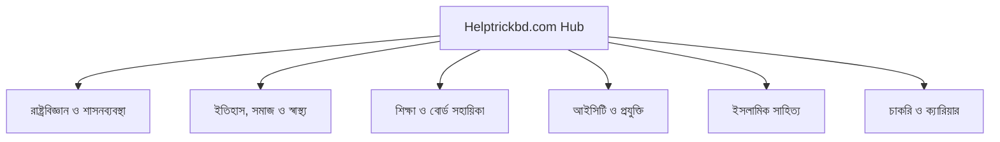

# 🏛️ Helptrickbd Topical Authority & Silo Cluster Blueprint
**Generated Date:** 2026-09-16 14:27 UTC
**Total Live Articles Analyzed:** 86 | **Total Silo Clusters:** 7

> গুগলের Helpful Content System ও Topical Authority অ্যালগরিদমে শীর্ষ র‍্যাংক পাওয়ার জন্য নিচে প্রতিটি কন্টেন্ট সাইলোর আর্কিটেকচার তুলে ধরা হলো।

## 📊 ১. সাইলো ক্লাস্টার সামারি ও হেলথ স্কোর
| ক্রম | কনটেন্ট সাইলো (Topic Silo) | বর্তমান পোস্ট | পিলারের স্থিতি | সাইলো হেলথ | স্ট্যাটাস |
| :---: | :--- | :---: | :--- | :---: | :---: |
| 1 | **রাষ্ট্রবিজ্ঞান ও শাসনব্যবস্থা (Political Science)** | **17 টি** | [`সরকারি প্রাথমিক শিক্ষক নি...`](https://www.helptrickbd.com/2026/09/primary-teacher-job-viva-preparation.html) | `100%` | 🟢 Strong |
| 2 | **সাধারণ জ্ঞান ও অন্যান্য (General Studies)** | **37 টি** | [`১৯০৯ সালের ভারত শাসন আইন:...`](https://www.helptrickbd.com/2025/12/morley-minto-reforms-1909-features-importance.html) | `100%` | 🟢 Strong |
| 3 | **শিক্ষা ও বোর্ড শিক্ষার্থী সহায়িকা (Academic & Board Guides)** | **4 টি** | [`এসএসসি পরীক্ষার্থীদের জন্...`](https://www.helptrickbd.com/2025/04/important-instructions-for-ssc-candidates.html) | `66%` | 🟡 Good |
| 4 | **আইসিটি ও কম্পিউটার শিক্ষা (ICT & Technology)** | **3 টি** | [`কম্পিউটার ভাইরাস ও সাইবার...`](https://www.helptrickbd.com/2026/09/computer-virus-cyber-security-guide-2026.html) | `50%` | 🔴 Needs Posts |
| 5 | **চাকরি ও ক্যারিয়ার প্রস্তুতি (Job & Career)** | **3 টি** | [`অলস ও ব্যাকবেঞ্চারদের জন্...`](https://www.helptrickbd.com/2024/12/simple-guide-to-job-and-bcs-preparation.html) | `50%` | 🔴 Needs Posts |
| 6 | **ইতিহাস, সমাজ ও স্বাস্থ্য (History & Society)** | **15 টি** | [`কম্পিউটার কাকে বলে? কম্পি...`](https://www.helptrickbd.com/2025/12/computer-definition-history.html) | `100%` | 🟢 Strong |
| 7 | **ইসলামিক সাহিত্য ও নাশিদ (Islamic Literature)** | **7 টি** | [`মিলাদ শরীফের ক্বাসিদা: মা...`](https://www.helptrickbd.com/2025/03/marhaba-ya-marhaba-rahmatullah-alamin-e-marhaba-lyrics.html) | `100%` | 🟢 Strong |

## 🗺️ ২. টপিকাল অথরিটি সম্পন্ন করার জন্য প্রয়োজনীয় নতুন পোস্টসমূহ (Action Blueprint):

### 📌 শিক্ষা ও বোর্ড শিক্ষার্থী সহায়িকা (Academic & Board Guides)
- **বর্তমান স্বাস্থ্য:** `66%` (4/6 পোস্ট)
- **এই ক্লাস্টারকে গুগলে ১০০% ডমিনেট করতে যেসব নতুন পোস্ট প্রয়োজন:**
  * ✍️ **বোর্ড পরীক্ষার খাতা মূল্যায়নের গোপন ট্রিকস ও নিয়ম**
  * ✍️ **জেএসসি ও এসএসসি গ্রেডিং পয়েন্ট (GPA) হিসাব করার সঠিক পদ্ধতি**

### 📌 আইসিটি ও কম্পিউটার শিক্ষা (ICT & Technology)
- **বর্তমান স্বাস্থ্য:** `50%` (3/6 পোস্ট)
- **এই ক্লাস্টারকে গুগলে ১০০% ডমিনেট করতে যেসব নতুন পোস্ট প্রয়োজন:**
  * ✍️ **কম্পিউটার ভাইরাস ও সাইবার নিরাপত্তা থেকে বাঁচার সেরা উপায়**
  * ✍️ **ক্লাউড কম্পিউটিং কি? প্রকারভেদ ও বাস্তব সুবিধা**
  * ✍️ **ইন্টারনেট প্রটোকল (IP Address) ও ডোমেইন নেম সিস্টেম (DNS) ব্যাখ্যা**

### 📌 চাকরি ও ক্যারিয়ার প্রস্তুতি (Job & Career)
- **বর্তমান স্বাস্থ্য:** `50%` (3/6 পোস্ট)
- **এই ক্লাস্টারকে গুগলে ১০০% ডমিনেট করতে যেসব নতুন পোস্ট প্রয়োজন:**
  * ✍️ **বিসিএস প্রিলিমিনারি ২০০ নম্বরের বিষয়ভিত্তিক মানবণ্টন ও বুক লিস্ট**
  * ✍️ **সরকারি প্রাথমিক শিক্ষক নিয়োগ ভাইভায় সাধারণ ভুল ও প্রতিকার**
  * ✍️ **ব্যাংক জব ও গণিত শর্টকাট টেকনিক (বাংলা ও ইংরেজি সমাধান)**

## 📐 ৩. সাইলো ক্লাস্টার ভিজ্যুয়াল আর্কিটেকচার ডায়াগ্রাম:
